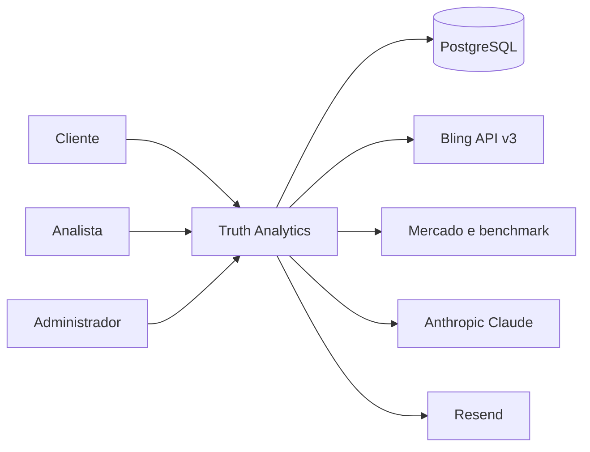
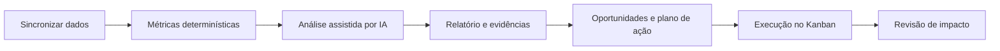

# Truth Analytics README Rewrite Implementation Plan

> **For agentic workers:** REQUIRED SUB-SKILL: Use superpowers:subagent-driven-development (recommended) or superpowers:executing-plans to implement this plan task-by-task. Steps use checkbox (`- [ ]`) syntax for tracking.

**Goal:** Replace the outdated README with an accurate, balanced product and engineering guide for the production Truth Analytics platform.

**Architecture:** Keep `README.md` as the concise entry point and link to versioned specs, plans, and runbooks for deeper material. Derive volatile facts from repository sources, separate implemented capabilities from the 300K roadmap, and use two Mermaid diagrams to explain current system context and operational flow.

**Tech Stack:** Markdown, Mermaid, Next.js 16.2.12, React 19.2.8, TypeScript 5, PostgreSQL, Drizzle ORM 0.45.2, Auth.js 5 beta.32, Vitest, Playwright, GitHub Actions, Vercel.

## Global Constraints

- Write in Brazilian Portuguese with a calm, direct, professional tone.
- Preserve the exact distinction between implemented functionality and the Growth Operating System 300K roadmap.
- Use placeholders only inside explicitly labeled environment-variable examples; never include real credentials.
- Use at most two Mermaid diagrams and keep each at one abstraction level.
- Do not claim absolute security, causal certainty, or completed roadmap capabilities.
- Derive versions and scripts from `package.json`, environment names from `.env.example`, and CI behavior from `.github/workflows/ci.yml`.
- Avoid static badges for volatile test counts.

---

### Task 1: Rewrite the README around product and user journeys

**Files:**
- Modify: `README.md`
- Reference: `docs/superpowers/specs/2026-07-28-readme-design.md`
- Reference: `docs/superpowers/specs/2026-07-27-growth-operating-system-300k-design.md`

**Interfaces:**
- Consumes: current routes under `src/app`, modules under `src/modules`, runtime versions from `package.json`, and production URL `https://truth-analytics.vercel.app`.
- Produces: the executive and product-facing first half of `README.md`, including current capabilities and the explicit 300K north star.

- [ ] **Step 1: Record the stale baseline**

Run:

```powershell
rg -n "Next\.js 14|React 18|tema dark|188 testes|10 testes E2E|Próximos passos: smoke real|MVP completo" README.md
```

Expected: the command finds the outdated framework versions, theme description, test counts, and pre-deploy status.

- [ ] **Step 2: Replace the opening and product sections**

Rewrite the beginning of `README.md` with this content model:

```text
Truth Analytics
├── one-sentence product definition
├── production and repository links
├── stable technology/status badges
├── product problem and operating cycle
├── 300K north star, labeled as strategy
├── actor table: client, analyst, administrator
└── implemented capabilities grouped by business domain
```

The capabilities section must cover dashboard and reports, Bling synchronization, stock, kits, commercial calendar, alerts and notifications, CRM/Kanban, cycles, analyst portfolio and comparison, administration, operations, playbooks, PDF reports, and AI-supported analysis. Describe only behavior evidenced by current routes/modules.

- [ ] **Step 3: Add current-state diagrams**

Add exactly two Mermaid blocks:





Adapt labels and annotations for Portuguese and current behavior, but do not add queues, microservices, autonomous marketplace writes, or future 300K entities.

- [ ] **Step 4: Verify the product half against routes**

Run:

```powershell
rg --files src/app | Where-Object { $_ -match '(page|route)\.tsx?$' } | Sort-Object
rg -n "dashboard|estoque|kits|calendario|plano-de-acao|comparativo|consultoria|operacoes|performance|playbooks" README.md
```

Expected: each major route family has a corresponding README description, with no roadmap-only route presented as available.

### Task 2: Document architecture, security, development, and operations

**Files:**
- Modify: `README.md`
- Reference: `.env.example`
- Reference: `.github/workflows/ci.yml`
- Reference: `src/lib/test-database-safety.ts`
- Reference: `docs/runbooks/onboarding-cliente.md`
- Reference: `docs/runbooks/rotacao-segredos.md`
- Reference: `docs/runbooks/exclusao-de-dados-org.md`

**Interfaces:**
- Consumes: the product sections from Task 1 and current repository configuration.
- Produces: the technical and operational second half of `README.md`.

- [ ] **Step 1: Add architecture and data-boundary sections**

Document the modular monolith and these boundaries:

```text
App Router / Server Components / Server Actions
        ↓ authenticated and tenant-scoped calls
Domain modules and capability-specific repositories
        ↓ parameterized Drizzle queries
PostgreSQL source of truth

External adapters: Bling, market providers, Anthropic, Resend
Operational entry points: cron routes, pipeline route, heartbeats, watchdog
```

State that deterministic metrics remain authoritative and AI produces structured analysis and recommendations. Explain tenant scope through authenticated context and `org_id`, with server-side authorization for client, analyst, and admin paths.

- [ ] **Step 2: Add security and reliability controls**

Cover the implemented controls by mechanism:

```text
Auth.js credentials sessions + bcrypt password hashes
role and organization authorization on the server
AES-256-GCM for Bling OAuth tokens and versioned key rotation support
login rate limiting and recovery flows
security headers and CSP
audit records for privileged operations
dependency audit in CI
remote destructive-test database guard
disposable PostgreSQL 16 in CI
```

Avoid the sentence “o sistema é seguro”. Use “controles implementados” and link to the relevant runbooks.

- [ ] **Step 3: Add reproducible local setup**

Document Node.js 22.19+ and npm, then use the exact commands:

```bash
npm ci
Copy-Item .env.example .env.local
npm run db:migrate
npm run db:seed-admin
npm run dev
```

Present environment variables in groups: database, auth/crypto, Bling, Anthropic, market, email, internal jobs, and optional observability. Use `<valor>` only inside the explicitly labeled sample block.

- [ ] **Step 4: Document every package script**

Create a script table derived from `package.json` that includes:

```text
dev, build, start, lint, typecheck, test, test:ci, test:watch, test:e2e,
db:generate, db:migrate, db:migrate:test, db:seed-admin, db:seed-analista,
db:reencrypt, db:purge-org
```

Mark `db:reencrypt` and `db:purge-org` as operational commands that require reading their runbooks and confirming the target environment.

- [ ] **Step 5: Document CI/CD and deployment**

Describe the actual GitHub Actions order:

```text
npm ci → production dependency audit → test migrations → lint → typecheck
→ Vitest → Next.js build → Chromium install → Playwright
```

Explain that pushes to `master` create a Vercel production deployment and link to `https://truth-analytics.vercel.app`. Describe post-deploy verification as HTTP smoke, authentication redirect, deployment status, and error-log scan.

### Task 3: Add navigation, roadmap, and evidence-based status

**Files:**
- Modify: `README.md`
- Reference: `docs/superpowers/specs/2026-07-27-growth-operating-system-300k-design.md`
- Reference: `docs/superpowers/plans/2026-07-27-p0a-security-build-reliability.md`
- Reference: `docs/superpowers/plans/2026-07-28-readme-rewrite.md`

**Interfaces:**
- Consumes: complete README content from Tasks 1 and 2.
- Produces: documentation index, recent improvements, current limitations, roadmap, and final repository handoff.

- [ ] **Step 1: Add documentation and runbook index**

Link using repository-relative paths to:

```text
Growth Operating System 300K spec
current README design spec
P0A security/build reliability plan
client onboarding runbook
secret rotation runbook
organization data deletion runbook
quality audits
```

- [ ] **Step 2: Add recent improvements with verified scope**

Summarize the landed work:

```text
Next.js 16 and React 19 migration
Auth.js and dependency security updates
Drizzle/PostgreSQL error unwrapping
hermetic test environment and destructive-database guard
disposable PostgreSQL CI gate
mobile navigation portal and focus behavior
analyst menu discoverability
Kanban assignee select containment
production Vercel deployment
```

Do not describe commit-by-commit history; explain user and operator impact.

- [ ] **Step 3: Separate current limitations from roadmap**

List only confirmed limitations, including the remaining React `useFormState` migration warnings, existing ESLint warnings, and known metadata authorization ordering debt. Then summarize roadmap phases P1 through P4 from the 300K spec without presenting their entities or screens as implemented.

- [ ] **Step 4: Remove stale claims**

Run:

```powershell
rg -n "Next\.js 14|React 18|tema dark|188 testes|10 testes E2E|Próximos passos: smoke real|MVP completo" README.md
```

Expected: no matches.

### Task 4: Validate the README and publish the change

**Files:**
- Modify: `README.md` only if validation finds a documentation defect.
- Verify: `README.md`

**Interfaces:**
- Consumes: final README from Tasks 1–3.
- Produces: reviewed Markdown committed on a feature branch and ready for PR validation.

- [ ] **Step 1: Check Markdown structure and local links**

Run this PowerShell validation:

```powershell
$readme = Get-Content -Raw -LiteralPath README.md
$fences = ([regex]::Matches($readme, '(?m)^```')).Count
if ($fences % 2 -ne 0) { throw 'README possui cerca Markdown não fechada.' }
$links = [regex]::Matches($readme, '\[[^\]]+\]\((?!https?://|#)([^)]+)\)')
foreach ($link in $links) {
  $target = $link.Groups[1].Value.Split('#')[0]
  if ($target -and -not (Test-Path -LiteralPath $target)) { throw "Link local ausente: $target" }
}
```

Expected: exit code 0, with an even number of Markdown fences and every local target present.

- [ ] **Step 2: Scan for leaked credentials and placeholders**

Run:

```powershell
rg -n "Matheus2003|1357|gho_[A-Za-z0-9]+|sk-ant-[A-Za-z0-9_-]+|postgres(ql)?://[^<\s]+:[^<\s]+@" README.md
```

Expected: no matches.

- [ ] **Step 3: Run repository verification**

Run:

```bash
npm run lint
npm run typecheck
npm run test:ci
```

Expected: all commands exit 0. Existing lint warnings may remain, but no lint errors may be introduced.

- [ ] **Step 4: Review the final diff**

Run:

```bash
git diff --check
git diff -- README.md docs/superpowers/specs/2026-07-28-readme-design.md docs/superpowers/plans/2026-07-28-readme-rewrite.md
git status --short
```

Expected: no whitespace errors; the diff contains only the approved README, design spec, and implementation plan.

- [ ] **Step 5: Commit and publish**

Run:

```bash
git add README.md docs/superpowers/specs/2026-07-28-readme-design.md docs/superpowers/plans/2026-07-28-readme-rewrite.md
git commit -m "docs: rebuild project README"
git push -u origin agent/readme-rewrite
```

Open a draft pull request against `master`, wait for CI and Vercel checks, then merge only after all required checks pass.
